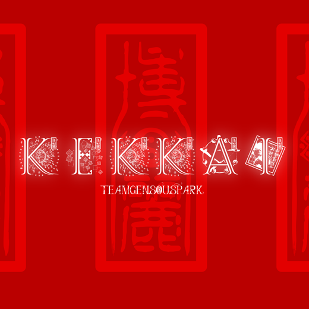

## Notice

#### **If there is no danmakucore or mirror,there is no kekkai,remember to show the best respect to TeamNightclipse's staff when using!**

## What's this?

It's a lib for 1.12.2 Touhou Danmaku Developer,there are 2 version of jar.

kekkai-all: contain Kekkai , DanmakuCore , Mirror

kekkai: only Kekkai

Kekkai will offer you some class or static method to execute the DanmakuCore or register a item/spellcard...

### How to use

1. Install **Minecraft** and **Forge(>=1.12.2-2847)**
2. Download this mod from the repo
3. Put them on **mods** directory
4. Launch Game and Enjoy

## Credits

https://github.com/TeamNightclipse/DanmakuCore

https://github.com/TeamNightclipse/Mirror

https://github.com/TeamGensouSpark/LunarCapitalFramework